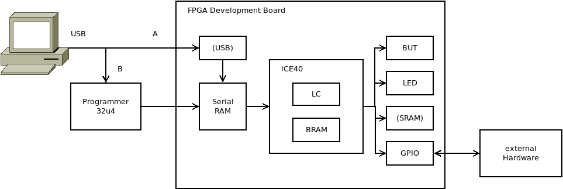
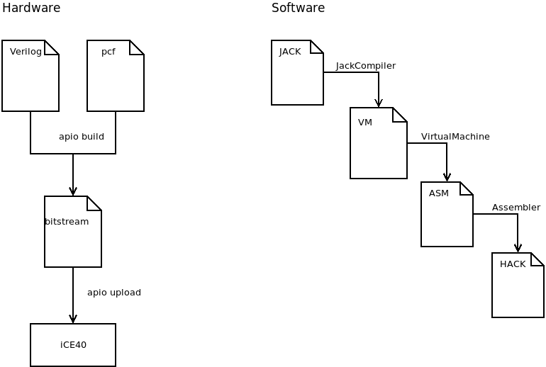
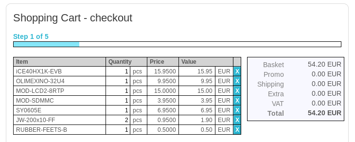

# Requirement

## FPGA-Board

In this project we will implement the Hack computer of the Nand2Tetris course in real hardware.
This is done with a development board featuring a so called field programmable array (FPGA).
The FPGA is a small piece of silicon holding lots of logic cells (LC) and [block RAM](https://nandland.com/lesson-15-what-is-a-block-ram-bram/) (BRAM), which can be routed programmatically.



On a typical FPGA-development board you will find:

|Component | Description|
|-|-|
|FPGA-chip ([iCE40](https://en.wikipedia.org/wiki/ICE_(FPGA)#iCE40_(40_nm))) | Holds logic cells and block RAM, which can be routed programmatically |
|Serial RAM | Holds the bit stream data, which is a binary representation of the circuits you want to implement on the FPGA.  At startup FPGA loads bit stream from serial RAM and configures its logic cells to become the machine you want the FPGA to be. |
| USB (A) | Some boards have a USB connector. This is needed to upload the bit stream file to the serial RAM. |
| Programmer (B) | Boards without a USB connector need an external programmer to upload code to the board. |
| LED | Most development boards come with some LEDs. This are user programmable and can be used to enter data or for debugging. |
| BUT | Most development boards come with some buttons. This are user programmable and can be used to enter data or for debugging. |
| GPIO | All boards come with general purpose in-/output pins. This pins can be used to connect external hardware. We will use this pins to connect an LCD screen, SD-Card, Speaker and Touch-panel. |
| SRAM | Some boards have a static RAM chip on board.  This is useful if you need more memory is than what is available on the block RAM inside the FPGA. If you want to run Tetris or Pong on your Hack, you should consider to look for a board with SRAM. |

In this tutorial we use FPGA-boards from [Olimex](https://www.olimex.com), which have the nice property of having SRAM (256x16bit) on board.

|Board|FPGA|LC|BRAM|SRAM|
|--|---|--|--|--|
|Olimex iCE40-HX1K-EVB|iCE40-HX1K|1280|64K Bits|256K x 16 bit|
|Olimex iCE40-HX8K-EVB|iCE40-HX8K|7680|128K Bits|256K x 16 bit|

Our final implementation of Hack needs ~1200 Logic cells!
So the smaller (nicer form factor) and cheaper iCE40HX1K-EVB is ok.
The BRAM of the smaller board translates to 4K x 16 bit of RAM for stack/heap of Hack and the external SRAM is used to implement a 64K x 16 bit instruction memory, which can be loaded with Hack code at boot time.

## Tools

The modules of our Hack computer (ALU, CPU, Register, Memory, IO) are implemented in Verilog, a standard hardware description language similar to HDL from Nand2Tetris.
So we need tools to translate Verilog-code to the so called bit stream, which is a binary representation of all the wires between the logic cells we want to activate.
Finally we need tools to upload the bit stream file to the FPGA board.

We will use [iCE40-FPGA](https://en.wikipedia.org/wiki/ICE_(FPGA)#iCE40_(40_nm)) from Lattice Semiconductors, because they have the nice property that there exists a complete free and open source toolchain [Project Icestorm](http://www.clifford.at/icestorm/) for programming:

| Tool | Description |
|-|-|
|[`YoSYS`](https://yosyshq.net/yosys/) | Register-transfer level (RTL) [syntesization](https://www.fpga4fun.com/FPGAsoftware5.html) of Verilog code to  to a gate-level [netlist](https://en.wikipedia.org/wiki/Netlist).|
|[`nextpnr`](https://github.com/YosysHQ/nextpnr) | A [place-and-route](https://www.fpga4fun.com/FPGAsoftware5.html) tool.|
| [`iceprog`](https://hedmen.org/icestorm-doc/icestorm.html#iceprog-Invocation) | Simple programming tool for [FTDI](https://ftdichip.com)-based [Lattice](https://www.latticesemi.com) [iCE](https://en.wikipedia.org/wiki/ICE_(FPGA)) programmers which can read, write and erase the flash and write the SRAM of an FPGA.|
| [`gtkwave`](http://gtkwave.sourceforge.net) | A wave viewer which simulates and visualizes signals in FPGA circuits.|



To run Hack we also need some Hack-code. The simpler projects like a blinking LED can be programmed direcly in Assembler. Harder tasks like the driver for the LCD-screen are programmed in Jack, translated for the virtual machine and finally compiled to Hack code.

## Get started

### Buy the hardware

FIXME: You are here:

- https://www.olimex.com/Products/Components/Cables/CABLE-IDC10-15cm/ instead of one of the JW-200x10-FF
- Pins: Change from 5V to 3.3V
- No real need for rubber dots (can't fit them anyway)
- Not
iceprogduino -I/dev/tty.usbmodem143201 -v hardware.bin
but
iceprogduino -I/dev/cu.usbmodem143201 -v hardware.bin
- brew install libftdi
- brew install eigen
- pip install iCEburn
- remove .py in Makefile of /icestorm/examples/iceblink
- https://www.olimex.com/forum/index.php?topic=7802.0


For projects 1+2 any FPGA board will work.
For projects 3-5 you need FPGA-board with external SRAM on board, to store larger Hack files.
The last projects 6-9 connect to external hardware like  LCD-screen and SD-card reader.
The project has been tested with:

* iCE40 Board: [iCE40HX1K-EVB](https://www.Olimex.com/Products/FPGA/iCE40/) or [iCE40HX8K-EVB](https://www.Olimex.com/Products/FPGA/iCE40/)
* Programmer: [Olimexino-32u4](https://www.Olimex.com/Products/Duino/AVR/OLIMEXINO-32U4/open-source-hardware)
* 2.8 Inch LCD color screen with resistive touch panel: [MOD-LCD2.8RTP](https://www.Olimex.com/Products/Modules/LCD/MOD-LCD2-8RTP)
* SD-Card connector: [MOD-SDMMC](https://www.Olimex.com/Products/Modules/Interface/MOD-SDMMC/open-source-hardware)

Check the bill of material and consider to buy at Olimex Ltd., the company with the highest number of registered OSHW-projects.



### Install the tools

#### apio

Apio (pronounced [ˈa.pjo]) is a multi platform toolbox, with static pre-built packages, project configuration tools and easy command interface to verify, synthesize, simulate and upload your Verilog designs.

 Visit [apio](https://github.com/FPGAwars/apio) and follow the install instruction.
 This will automatically install the whole toolchain consisting of:

* iCE40 tools: [Project Icestorm](http://www.clifford.at/icestorm/)
* Signal visualizer: [gtkwave](http://gtkwave.sourceforge.net/)

```bash
pip install -U apio
apio install -a
```

Apio currently runs [Icarus verilog](https://iverilog.fandom.com/wiki/Main_Page) under the hood

##### Install on MacOX

A few extra steps are required to install on MacOX

```bash
brew install gtkwave
# From https://ughe.github.io/2018/11/06/gtkwave-osx
cpan install Switch  # Go with the standard option
```

followed by

```bash
perl -V:'installsitelib'
```

If this does not return `/Library/Perl/5.*/`, do

```bash
sudo cp /usr/local/Cellar/perl/5.*/lib/perl5/site_perl/5.*/Switch.pm /Library/Perl/5.*/
```

The following should now work

```bash
/Applications/gtkwave.app/Contents/Resources/bin/gtkwave
```

Add the following to either `~/.bash_profile` or `~/.zshrc`

```bash
export PATH=/Applications/gtkwave.app/Contents/Resources/bin/:$PATH
```

##### Learn apio

To learn usage of apio do the example projects provided by apio.

```bash
apio examples -d iCE40-HX1K-EVB/leds
cd iCE40-HX1K-EVB/leds
apio sim
apio build
```

If you go with Olimex boards you additionally have to install the programmer software `iceprogduino` on your Olimexino-32u4.

```bash
git clone https://github.com/OLIMEX/iCE40HX1K-EVB.git
cd iCE40HX1K-EVB/programmer/iceprogduino
make
sudo make install
```

Uploading can now be done with

```bash
apio upload
```

Test the programmer with the test project provided by Olimex.

#### Jack-Hack-tools

Jack-Hack-Tools: JackCompiler, VirtualMachine Translator and Assembler vor Hack should be developed by yourself.
Follow guidelines at [Nand2Tetris](https://www.Nand2Tetris.org/).

### Do some Verilog examples

There is no need to learn much Verilog.
Just dig into the example `Xor` and learn how to "translate" your HDL-files from Nand2Tetris into Verilog.

If you like to have some Verilog-background I recommend to do the tutorial of Juan González-Gomez (Obijuan), which starts at absolute beginners level [open-FPGA-Verilog-tutorial](https://github.com/Obijuan/open-fpga-verilog-tutorial/wiki/Home_EN).
This is mainly written in spanish, but clicking the `(EN)` buttons gets you to the English pages (this also applies for the index).

There is also the [Verilog tutorial for beginners](https://www.chipverify.com/verilog/verilog-tutorial) which goes a bit more in depth.

### Project

* [Build and test module `Xor`](chip_Xor)
