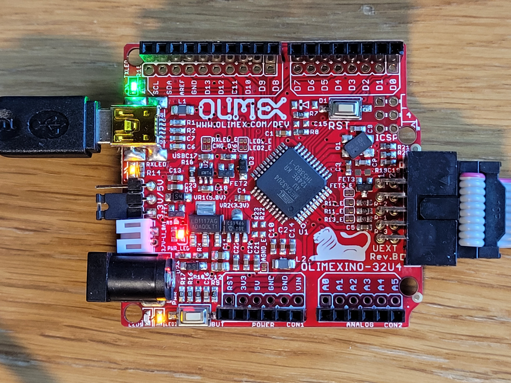
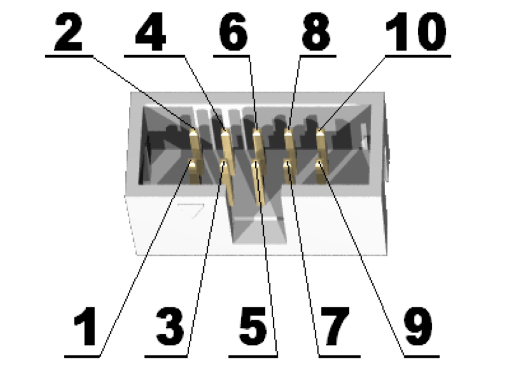
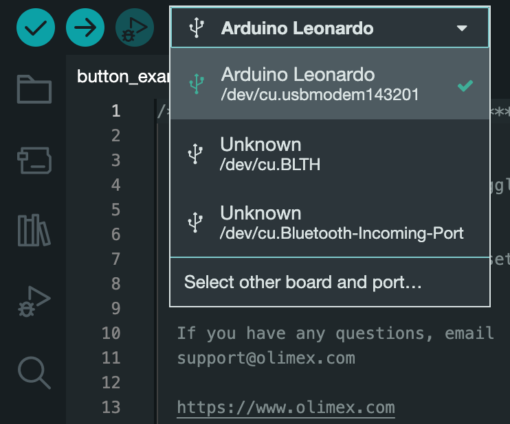
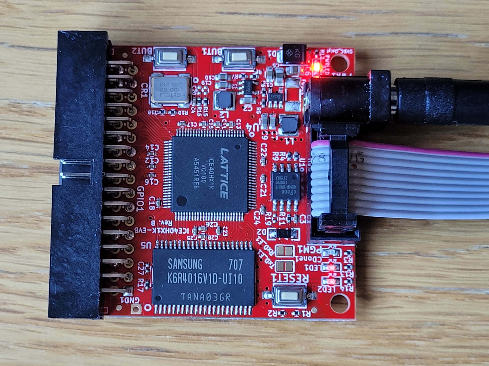

# Hello, world using Olimex

This guide will show how to connect your hardware and how to flash our FPGA.

If you need any help, you can always ask the [Olimex forum](https://www.olimex.com/forum/index.php?board=35.0).

This guide draws heavily on the [getting started guide](https://olimex.wordpress.com/2016/06/30/getting-started-with-fpga-with-only-free-and-open-source-software-and-hardware-tools-tutorial/) linked to from [this forum post](https://www.olimex.com/forum/index.php?topic=5402.0).

As I feel that some important steps are missing from the guide, I will outline the steps below.

## Wiring the programmer and FPGA

Our end-goal is to program our FPGA so that it reflects our Hack platform.
As this FPGA has no USB connection, we need to go through an intermediate step, namely the programmer.
In principle any programmer could do, but we will here use the [Olimexino-32u4](https://www.Olimex.com/Products/Duino/AVR/OLIMEXINO-32U4/open-source-hardware) programmer.

### Connecting the programmer

Once the programmer has been connected and `iceprog` has been uploaded your board should look like this



1. Move the jumper to 3.3V.

   > **NOTE**: This part may be very confusing.
   > I've spent one day debugging only to realizing that the jumper was in the wrong position (`iceprog` pretends like everything is fine if this is the case).
   > Although I find it conflicting with what I read in "7.6 Jumper description" the [32U4 programmer user guide](../../datasheets/OLIMEXINO-32U4.pdf), but I only managed to flash to the FPGA if the jumper was in the position in the image above and what is described here.
   > Note that this is also the position indicated on the picture in the [getting started tutorial](https://olimex.wordpress.com/2016/06/30/getting-started-with-fpga-with-only-free-and-open-source-software-and-hardware-tools-tutorial/).

   This means that the jumper is moved so that is closest to the battery connector (the white element between the jumper and the power inlet) and that the pin closest to the USB Mini B port is bare as indicated in the image above
2. Connect the [UEXT](../../datasheets/UEXT_rev_B.pdf) with either a [CABLE-IDC10-15cm ribbon](https://www.olimex.com/Products/Components/Cables/CABLE-IDC10-15cm/) or with [female-to-female jumper wires](https://www.olimex.com/Products/Breadboarding/JUMPER-WIRES/JW-200x10-FF/).
  If you go for the ribbon there will only be one way you can connect the wires due to the shape of the ribbon connector.
  If you use jumper wires you need to notice the small dent under pin 5 as seen in the image below.
  The pin number you connect from must match the pin number you connect to.
  
3. Plug the USB Mini B to your computer

You are now ready to use the programmer.
We will write to the programmer by using the `Arduino IDE`.

#### Install the Arduino IDE

1. Head to <https://www.arduino.cc/en/software> and download the latest `Arduino IDE` (for reference, I've used version 2.0.0).
2. Install the `Arduino IDE` by either clicking the icon or open it through a terminal

#### Test the programmer with a button program

1. Click on `File`, and open [`button_example.ino`](button_example/button_example.ino) located in the `button_example` directory of this directory.
2. Select `Arduino Leonardo` in the dropdown menu.
  
  If you're using Mac, it's important that you note the address (which in this case is `/dev/cu.usbmodem143201`, but may be `/dev/ttyACMO` if you're using Linux)
3. Click on the upload icon (the arrow pointing towards right in the image above)
4. The output should be something similar to

   ```text
   Sketch uses 4150 bytes (14%) of program storage space. Maximum is 28672 bytes.
   Global variables use 149 bytes (5%) of dynamic memory, leaving 2411 bytes for local variables. Maximum is 2560 bytes.
   Connecting to programmer: .
   Found programmer: Id = "CATERIN"; type = S
       Software Version = 1.0; No Hardware Version given.
   Programmer supports auto addr increment.
   Programmer supports buffered memory access with buffersize=128 bytes.

   Programmer supports the following devices:
       Device code: 0x44
   ```

`LED1` should now be green whilst `LED2` should be in the programmer.
If you press the `BUT` button repeatedly you can see the LEDs turn off and on.

#### Upload `iceprog` to the programmer

We will now upload the program which will flash to the FPGA, namely `iceprog`.

1. Clone the `iCE40HX1K-EVB` repository

   ```bash
   git clone https://github.com/OLIMEX/iCE40HX1K-EVB.git
   ```

2. Open `Arduino IDE`, and open the `iceprog.ino` file located in  `iCE40HX1K-EVB/programmer/olimexino-32u4\ firmwave/iceprog`.
   NOTE: At the time of writing this file contained a bug which is fixed by [PR 15](https://github.com/OLIMEX/iCE40HX1K-EVB/pull/15)
3. Click on the upload button as described in [Test the programmer with a button program](#test-the-programmer-with-a-button-program)

The output should be identical to the one obtained in [Test the programmer with a button program](#test-the-programmer-with-a-button-program).

You have now uploaded the program on the 32u4 programmer which will flash to the FPGA.
This means that you can use `iceprogduino` to communicate with the FPGA.

### Connecting the FPGA

We are now ready to connect the FPGA:

1. Disconnect the programmer from the computer
2. Connect either the [CABLE-IDC10-15cm ribbon](https://www.olimex.com/Products/Components/Cables/CABLE-IDC10-15cm/) or [female-to-female jumper wires](https://www.olimex.com/Products/Breadboarding/JUMPER-WIRES/JW-200x10-FF/) to the [UEXT](../../datasheets/UEXT_rev_B.pdf) as described in [Connecting the programmer](#connecting-the-programmer)
3. Plug the USB Mini B to your computer
4. Plug the 5V power adapter to the FPGA and then to the socket

If you've done everything correctly your FPGA will look something like this:



The `PWR` led will light brightly and `LED1` and `LED2` will probably glow faintly.

### Run the LED example using `apio`

We will now run the `Hello, world!` equivalent for the FPGA, namely turn off some LEDs by using `BUT1` and `BUT2` on the FPGA.

First we create the example from `apio`

```bash
apio examples -d iCE40-HX1K-EVB/leds
```

before we flash this to the FPGA we can simulate it with `gtkwave`.
This will use the `leds_tb.v` test bench to show the signals.

```bash
cd iCE40-HX1K-EVB/leds
apio sim
```

Furthermore we can synthesize the binaries by using

```bash
apio build
```

This will create the file `hardware.bin` which we will flash to the FPGA.

#### Upload with Linux

Under Linux you could simply type

```bash
apio upload
```

 to upload the binary file.

 If this gives some strange errors, it may make sense to follow the [Upload with MacOs](upload-with-macos) guide below.

#### Upload with MacOs

`apio` assumes that the programmer is connected to `/dev/ttyACM0`.
However, `apio` uses `iceprogduino` under the hood, where we can specify the port.

The easiest way to infer what port our programmer is connected to is to have a look at our `Arduino IDE` as described in
[Test the programmer with a button program](#test-the-programmer-with-a-button-program).
This will show you the port number.
In my case this is `/dev/cu.usbmodem143201`.
We can upload the binary with

```bash
iceprogduino -I/dev/cu.usbmodem143201 hardware.bin
```

#### Try the example

If everything is working you can see that the LEDs on the programmer turns off (except the red LED), and that `LED1` and `LED2` of the FPGA is blinking.

The output of the uploading function should be similar to

```text
Serial: /dev/ttyACM0: Success
file size: 32220
erase 64kB sector ar 0x000000..erased

programming..
Manufacturer ID: 0x1C / Device ID: 0x7015
prog 0x007D00 +0x0DC....
Bye.
```

on Linux, and

```text
Serial: /dev/cu.usbmodem143201: Undefined error: 0
file size: 32220
erase 64kB sector at 0x000000..erased

programming..
Manufacturer ID: 0x1C / Device ID: 0x7015
prog 0x007D00 +0x0DC....
Bye.
```

If everything was successful, then the `PGM1` LED will be green, whilst `LED1` and `LED2` will be red.
Furthermore pushing `BUT1` will turn off the light of `LED1` and pushing `BUT2` will turn off the light of `LED2`.

## Troubleshooting

You can check if you can get the ID sequence of the FPGA by using the `-f` flag of `iceprogduino`.
You should see something like

```text
Test mode
Serial: /dev/ttyACM0: Success
Manufacturer ID: 0x1C / Device ID: 0x7015
Bye.
```

and not `Manufacturer ID: 0x00 / Device ID: 0x0000`

You should be able to read the flash by using the `-r` flag followed by a filename (for example `delme.bin`)

When reading the FPGA should look like indicated in [Connecting the FPGA](#connecting-the-fpga) while reading, and return to it's previous state when the reading is done.

The output should be similar to

```text
Serial: /dev/ttyACM0: Success

reading..
Manufacturer ID: 0x1C / Device ID: 0x7015
read 0x000000 +0x200000..
Requesting missmatched frames...

Writing data to file delme.bin
Bye.
```
