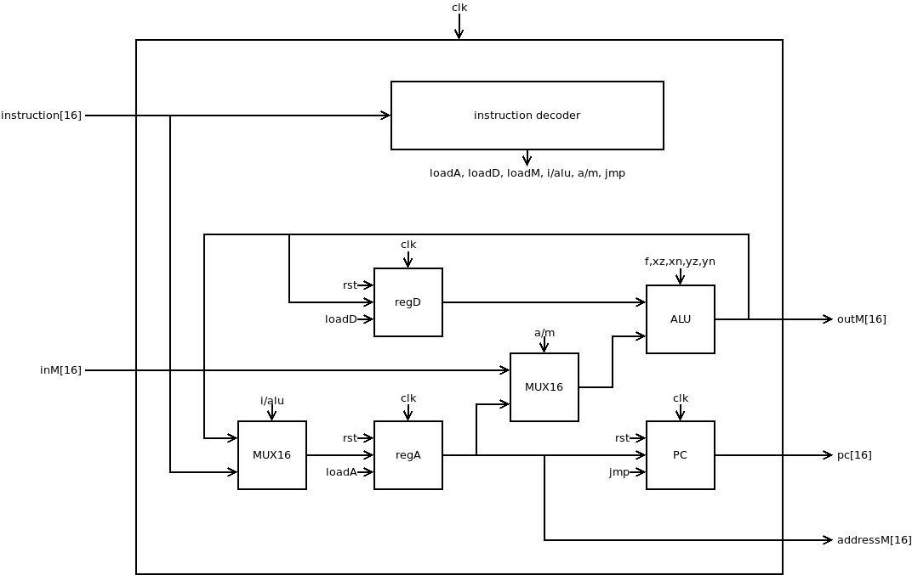
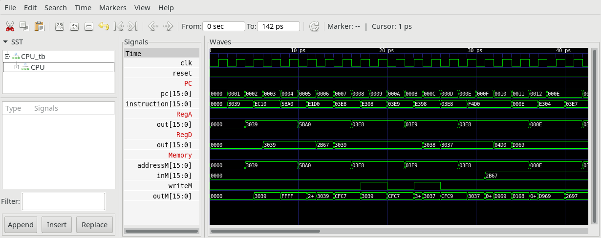

# CPU

## CPU.v

The Hack CPU (Central Processing unit)

The Hack CPU (Central Processing unit), consisting of an `ALU`, two registers named `A` and `D`, and a program counter named PC.
The CPU is designed to fetch and execute instructions written in the Hack machine language.
In particular, it functions as follows:
It will executes the inputted instruction according to the Hack machine language specification.
The `D` and `A` in the language specification refer to CPU-resident registers, while `M` refers to the external memory location addressed by `A`, i.e. to `Memory[A]`.
The `inM` input holds the value of this location.
If the current instruction needs to write a value to `M`, the value is placed in `outM`, the address of the target location is placed in the `addressM` output, and the `writeM` control bit is asserted.
(When `writeM==0`, any value may appear in `outM`).
The `outM` and `writeM` outputs are "combinational" (as opposed to "sequential").
I.e. they are affected instantaneously by the execution of the current instruction.
The `addressM` and `pc` outputs are clocked:
Although they are affected by the execution of the current instruction, they commit to their new values only in the next time step.
If `reset==1` then the CPU jumps to address `0` (i.e. `PC` is set to `0` in next time step) rather than to the address resulting from executing the current instruction.

## CPU_tb.v

Test bench performs some operations and generates `CPU.out`, which can be compared to `CPU.cmp`.

## Project

* Implement the `CPU` and all needed submodules.
  Use translation guide at `00_Requirement/Xor` to see how to translate your HDL-files into Verilog.
  (**Note:** `NAND` and `DFF` are considered primitive and thus there is no need to implement them.
* Simulate your implementation with the supplied Test bench `CPU_tb.v` using `apio sim`
* Verify by comparing `CPU.out` with `CPU.cmp`.
