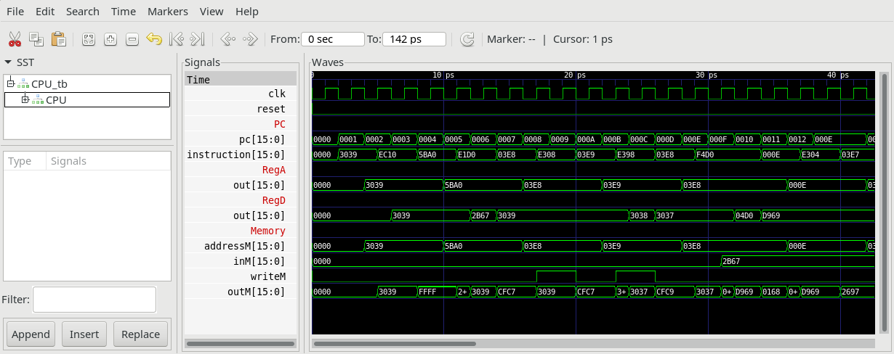

## CPU.v
The Hack CPU (Central Processing unit)

The Hack CPU (Central Processing unit), consisting of an ALU, two registers named A and D, and a program counter named PC. The CPU is designed to fetch and execute instructions written in the Hack machine language. In particular, functions as follows: Executes the inputted instruction according to the Hack machine language specification. The D and A in the language specification refer to CPU-resident registers, while M refers to the external memory location addressed by A, i.e. to Memory[A]. The inM input holds the value of this location. If the current instruction needs to write a value to M, the value is placed in outM, the address of the target location is placed in the addressM output, and the writeM control bit is asserted. (When writeM==0, any value may appear in outM). The outM and writeM outputs are combinational: they are affected instantaneously by the execution of the current instruction. The addressM and pc outputs are clocked: although they are affected by the execution of the current instruction, they commit to their new values only in the next time step. If reset==1 then the CPU jumps to address 0 (i.e. pc is set to 0 in next time step) rather than to the address resulting from executing the current instruction.

## CPU_tb.v

Testbench performs some operations and generates `CPU.out`, which can be compared to `CPU.cmp`.

## Project
* Implement the `CPU` and all needed submodules.

  Use translation guide at `00_Requirement/Xor` to see how to translate your HDL-files into verilog.

  **Note:** Nand and DFF are considered primitive and thus there is no need to implement them.

* Simulate your implementation with the supplied Testbench `CPU_tb.v`.
`$ apio sim`

* Verify by comparing `CPU.out` with `CPU.cmp`.
