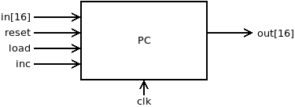
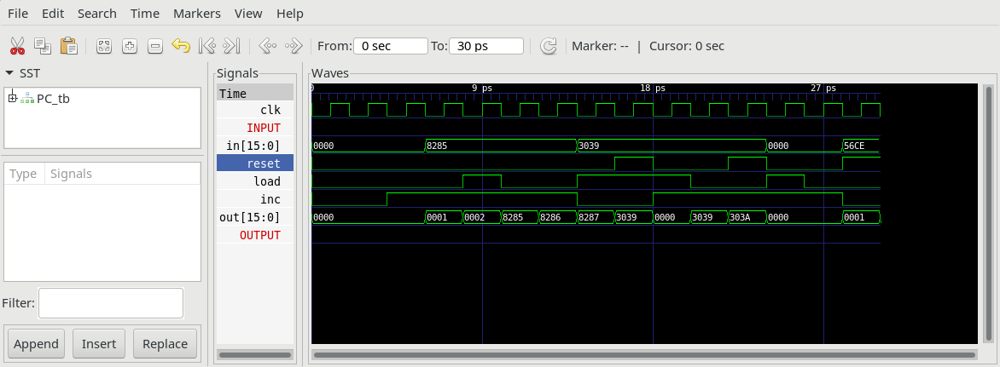

# Program counter

## PC.v



 A 16-bit counter with reset, load and inc control lines.

```text
if (reset[t] == 1) out[t+1] = 0
else if (load[t] == 1) out[t+1] = in
else if (inc[t] == 1) out[t+1] = out[t] + 1
else out[t+1] = out[t]
```

## PC_tb.v

Test bench increments loads and resets the PC.
It will generate `PC.out` which can be compared to `PC.cmp`.



## Project

* Implement the module `PC.v` and all needed submodules (`Bit`, `Register`, `HalfAdder` ...).
(**Note:** `DFF` and `NAND` are considered primitive and thus there is no need to implement them.)
* Simulate your implementation with the supplied test bench `PC_tb.v`.
* Compare `PC.out` with `PC.cmp`
* Verify by comparing with screenshot of `PC_tb.png`.
