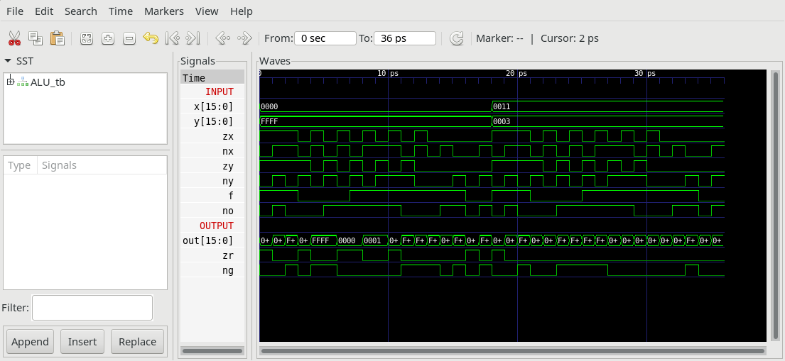

# ALU

## ALU.v

The ALU (Arithmetic Logic Unit).

Computes one of the following functions:

* `x+y`
* `x-y`
* `y-x`
* `0`
* `1`
* `-1`
* `x`
* `y`
* `-x`
* `-y`
* `!x`
* `!y`
* `x+1`
* `y+1`
* `x-1`
* `y-1`
* `x&y`
* `x|y`

on two 16-bit inputs, according to 6 input bits denoted `zx`, `nx`, `zy`, `ny`, `f` and `no`

In addition, the ALU computes two 1-bit outputs: if the ALU `out == 0`, `zr` is set to `1`; otherwise `zr` is set to `0`.
If the ALU `out < 0`, `ng` is set to `1`; otherwise `ng` is set to `0`.

Implementation: the ALU logic manipulates the x and y inputs and operates on the resulting values, as follows:

* `if (zx == 1)` set `x = 0` (16-bit constant)
* `if (nx == 1)` set `x = !x` (bitwise not)
* `if (zy == 1)` set `y = 0` (16-bit constant)
* `if (ny == 1)` set `y = !y` (bitwise not)
* `if (f == 1)`  set `out = x + y` (integer 2's complement addition)
* `if (f == 0)`  set `out = x & y` (bitwise and)
* `if (no == 1)` set `out = !out` (bitwise not)
* `if (out == 0)` set `zr = 1`
* `if (out < 0)` set `ng = 1`

## ALU_tb.v

The test bench performs some operations with ALU and generates `ALU.out`, which can be compared to `ALU.cmp`.

## Project

* Implement the `ALU` and all needed submodules (`Add16`, `And16`, `And`, `FullAdder`, `HalfAdder`, `Mux16`, `Mux`, `Not16`, `Not`, `Or8Way`, `Or`, `Xor`).
  You can use the translation Guide at `00_Requirement/Xor` to see how HDL-files can be translated into Verilog.
  (**Note:** `NAND` is considered primitive and thus there is no need to implement it.)
* Simulate your implementation with the supplied Test bench `ALU_tb.v`.
* Verify by comparing `ALU.out` with `ALU.cmp`.
