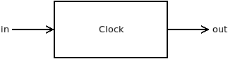
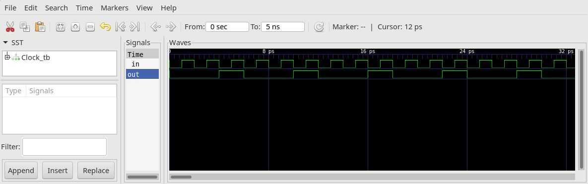

# Clock

## Clock.v

The module Clock provides the clock-signal for all sequential logic inside the FPGA.
It gets an input in of 100MHz from an external oscillator and delivers the output out 100/3 = 33.333333 MHz.

This is done because Hack will not run error free in real hardware when clocked to fast.

## Clock_tb.v

Test bench to generate clock signal.

## Project

* Implement the module `Clock.v` and all needed submodules.
(**Note:** `DFF` and `NAND` are considered primitive and thus there is no need to implement them.)
* Simulate your implementation with the supplied test bench `Clock_tb.v`.
* Verify by comparing with screenshot of `Clock_tb.png`.
