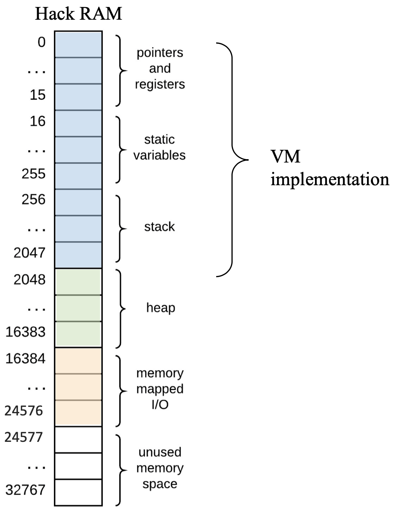
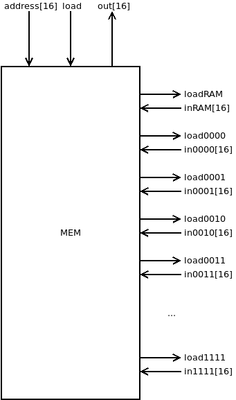
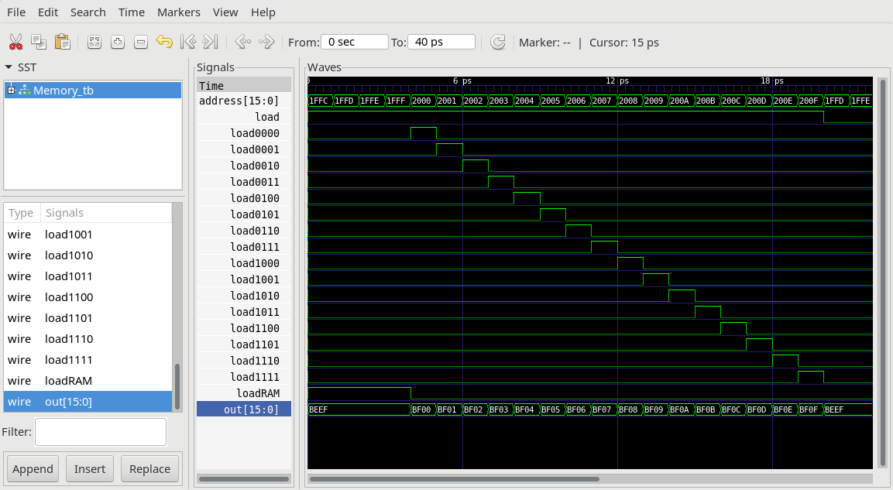

# Memory

## Memory.v

The chip responsible for memory mapped I/O.

> **NOTE**: This is not the same as RAM, but rather a way for specifying what peripheral should give the input to the CPU instead of the RAM.
> This will become more evident during the subsequent projects.

The chip can be implemented as a set of Multiplexer/De-multiplexer to map I/O-modules to address memory.

> **NOTE**: We spare the most significant bit as a control bit for selecting whether or not we should read from the RAM.
> This means that we go from `sum([2**i for i in range(14+1)])=32767` memory addresses to `sum([2**i for i in range(13+1)])=16383` memory addresses.
> In "The standard mapping of the Hack platform" (from the chapter 8 lecture) shown below, this means that the memory mapped I/O is no longer accessible through the RAM chip, but rather through this chip.



The memory chip will work as follows:

```text
// Loading the data (i.e. storing it)
if ((load==1) and (address[13]==0)) {loadRAM=1}
if ((load==1) and (address[13]==1 and address[3:0]==0000)) {load0000=1}
if ((load==1) and (address[13]==1 and address[3:0]==0001)) {load0001=1}
if ((load==1) and (address[13]==1 and address[3:0]==0010)) {load0010=1}
...
// Outputting the data from the MEM chip
if (address[13]==0) {out = inRAM}
if ((address[13]==1 and address[3:0]=0000)) {out = in0000}
if ((address[13]==1 and address[3:0]=0001)) {out = in0001}
if ((address[13]==1 and address[3:0]=0010)) {out = in0010}
...
```



## Memory_tb.v

Test bench to generate load signals for every Memory mapped module.



## Project

* Implement the module `Memory.v` and all needed submodules.
(**Note:** `DFF` and `NAND` are considered primitive and thus there is no need to implement them.)
* Simulate your implementation with the supplied test bench `Memory.v`.
* Verify by comparing with screenshot of `Memory_tb.png`.
