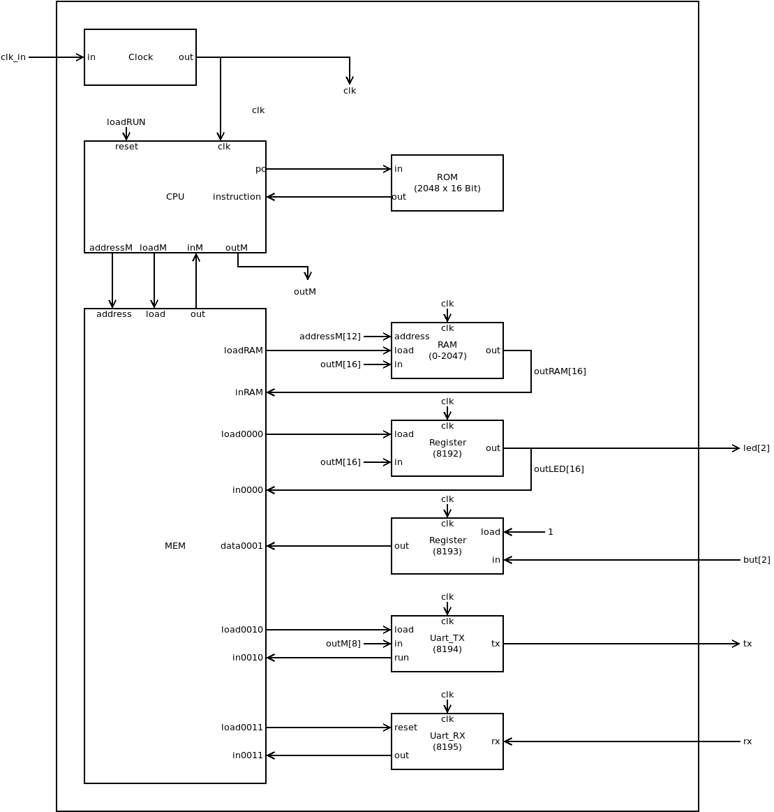

## Hack2.v
Hack2 has added support for UART (Universal asynchronous receive transmit) module and map it to memory location 8194/8295. UART mode is 115200 Bits/second with 1 start bit(0), 8 data bits and one stop bit(1). This is a standard serial communication interface available by most computers, so we can communicate with hack bytewise, sending and receiving  chars.

### Memory map

|address | memory|R/W|function|
 |-|-|-|-|
 |0-2047  | RAM|R/W|R0--R15, static, stack, heap|
 | 8192    | but|R/W|0 = button pressed, 1 = button released|
 | 8193    | led|R/W|0 = led off, 1 = led on|
 | 8194    | UART-TX|R|<0 busy, 0 = ready|
 | 8194    | UART-TX|W|write char to be send|
 | 8195    | UART-RX|R|M[8195]>=0 received byte, M[8195]<0 busy|
 | 8195    | UART-RX|W|write to clear buffer|

## Hack2_tb.v
The Test bench `Hack2_tb.v` transmitts a few bytes to. When ROM.v is loaded with `echo.asm` you should be able to see the echo.

**Note:** After startup UartTX transmitts a byte 0x00 due to the fact, that UartRX has a buffer entry of 0x00 with highest bit=0 (valid byte).

## Project

* Implement `Hack2.v`
* Preload `ROM.v` with `echo.hack`
* Simulate with test bench `Hack2_tb.v`
`$ apio sim`
* Compare output with `Hack2_tb.png`
* Build and upload to iCE40-HX1K-EVB
 `$ apio upload`
* Test `echo` running on FPGA with UART
`screen /dev/ttyACM0`
