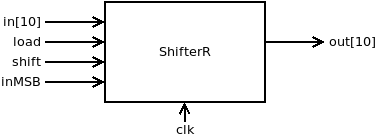
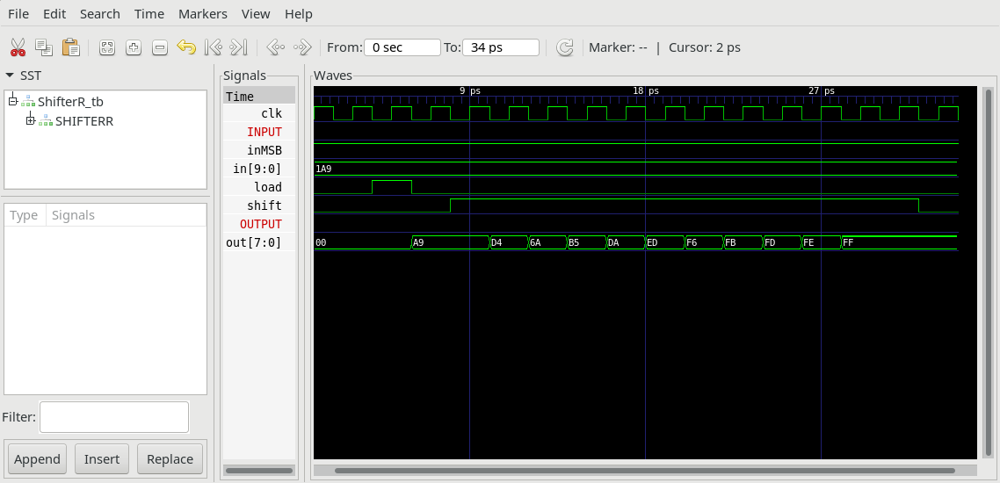

## ShifterR.v

10 bit Shiftregister used by UART

if (load == 1) out[t+1] = in[t]

else if (shift == 1) out[t+1] = out[t] shifted one bit to right with inMSB shifted into the register as most significant bit.

### Proposed implementation
Use 10 1-Bit Registers `Bit.v` and some `Mux.v`.

## ShifterR_tb.v
Test bench, that loads 10 bits into the register and then shifts it to the right.

## Project
* Implement `ShiterR.v`
* Test with test bench `ShifterR_tb.v`
* Compare timing diagram with `ShifterR_tb.png`
