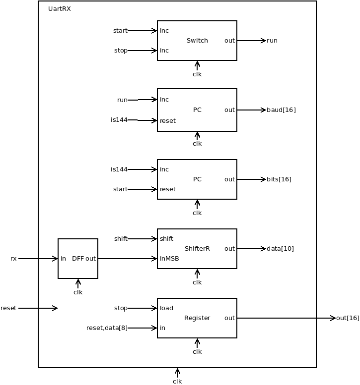
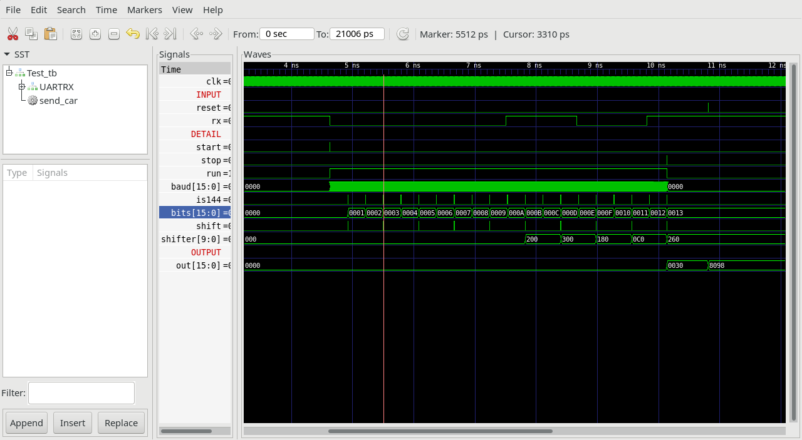

## UartRX.v

UartRX receives bytes over UART

If (ready = 1) and (rx = 0): modules starts receiving a byte:
1. set ready = 0
2. serial receive at line rx: 1 startbit(0), 8 data bits (LSB...MSB) and 1 stopbit(1) with 115200 Baud (bits per second)

after 9-bit out[7:0] holds the received byte with out[15] = 0
 (valid byte)

if (reset = 1) out[15] = 1 (receive buffer not valid)

### Proposed Implementation

**Important implementation detail:** rx must pass a DFF ot be registered in the clock domain! All other submodules use only rx_out (of DFF).

* Use a switch to store run-state. run starts, when rx_out==0 and run==0. run stops, when last bit is received.
* When run==1 a Counter increments every clock cycle. After 144 clock cycles the Counter resets.
* A second counter increments every 144 cycles.
* Every 288 clock cycles starting at 144 rx_out is shifted into the shiftregister.
* When transmission ends (10-bit) is sampled, shiftregister is stored in data register with highest bit set to 0 (valid byte).
* Buffer can be cleared by software (reset) at any time by setting highest bit of data register to 1 (byte not ready yet).

## UartRX_tb.v
Test bench, that transmits some bytes.

## Project
* Implement UartRX.v
* Test with test bench UartRX_tb.v
* Compare timing diagram with `UartRX_tb.png`
