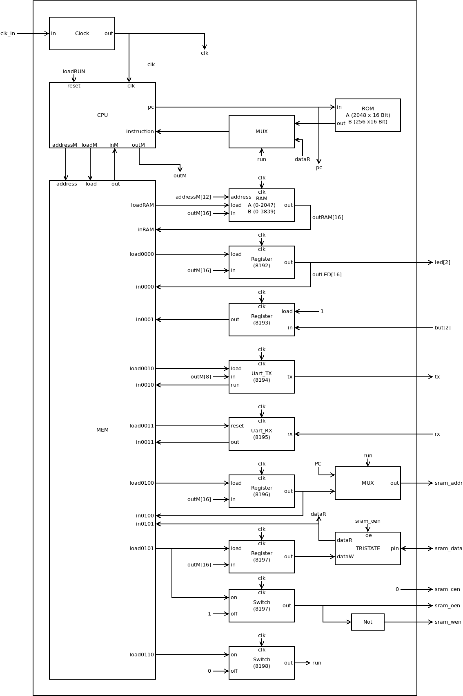
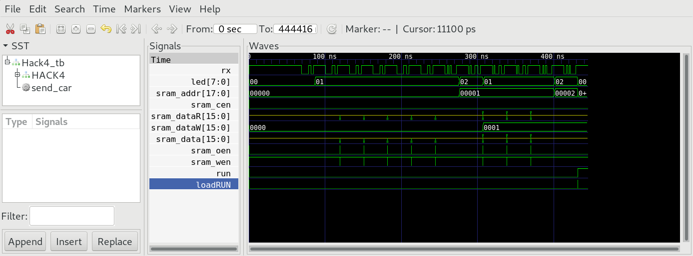

## Hack4.v
Hack4 adds a Switch RUN mapped to memory location 8198. RUN controlles instruction memory routing. When RUN==0, instruction is fetched from internal ROM of iCE40. When RUN==1, instruction is fetched from external SRAM. Writing to 8198 turns the Switch on and resets HACK to set PC to location 0.



### Memory Map

 |address space| memory|R/W|function|
 |-|-|-|-|
 |0-2047(A)  | RAM|R/W|R0--R15, static, stack, heap|
 |0-3839(B)  | RAM|R/W|R0--R15, static, stack, heap|
 | 8192    | but|R/W|0 = button pressed, 1 = button released|
 | 8193    | led|R/W|0 = led off, 1 = led on|
 | 8194    | UART-TX|R|-1 = busy, 0 = ready|
 | 8194    | UART-TX|W|write char to be send|
 | 8195    | UART-RX|R|>=0 received byte, <0 busy|
 | 8195    | UART-RX|W|write -1 to clear buffer|
 |8196|r_sram_addr|R/W|SRAM address for next operation|
 |8197|r_sram_data|R|SRAM data at selected address|
 |8197|r_sram_data|W|start write procedure|
 |8198|RUN|W|switch instruction memory to external SRAM and reset CPU.|


## Hack4_tb.v
The Test bench `Hack_tb.v` transmitts a few bytes representing hack-code to rx. When ROM.v is loaded with `jack/boot` you should be able to see writing and reading of sram. After end of transmission (two consecutive `\n`) Switch RUN is turned on, resetting the CPU and routing instruction memory to external SRAM (MUX16).



## Project

* Implement `Hack4.v` (Version A)
* Preload `ROM.v` with `jack/boot/out.hack`
* Simulate with test bench `Hack4_tb.v`
`$ apio sim`
* Compare output with `Hack4_tb.png`
* Build and upload to iCE40-HX1K-EVB
 `$ apio upload`
* Run `jack/boot` on real hardware (Hack4). Connect your PC to Hack over UART and send some Hack-code to store in SRAM and run from SRAM:

  ```
  $ cat asm/led.hack > /dev/ttyACM0
  $ cat asm/blinky.hack > /dev/ttyACM0
  $ cat asm/echo.hack > /dev/ttyACM0
  ```
