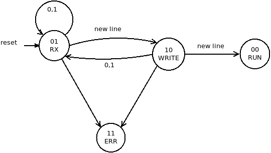

## jack/boot

The bootloader is written in Jack. It implements a finate state machine with 4 states (beginning with state 01):

* 00: RUN!
* 01: BOOT (start state)
* 10: WRITE to SRAM
* 11: ERROR




The state is stored @8192 so you can see what hack is doing at LEDs!

### Simulation
run `apio sim` with Hack4 and `jack/boot/out.hack` preloaded in ROM and check read and write-timings of SRAM. When Hack receives to consecutive `\n` chars. The bootloader should switch execution to external SRAM.

Check that HACK receives 12 bytes over UART-RX: ``0,0,0,0,0,\n,1,1,1,\n,\n`` and write two bytes to SRAM (SRAM[0]=0, SRAM[1]=7). Assert that LEDs show the state of the bootloader.


Inspect details after receiving two consecutive bytes ``\n,\n`` where execution goes to SRAM (bootloader mode 00 = RUN!). From this point sram_addr outputs the programmcounter (pc).

### Proof
run `apio upload` to upload Hack-4 to iCE40. Then switch olimexino 32u4 to UART-Bridge and launch a terminal connection to UART:

```
$ apio upload
$ (change mode of olimexino 32u4 to UART-Bridge)
$ screen /dev/ttyACM0 115200
```

Now you should be able to enter Hack code in the terminal. After entering two consecutive `\n` chars execution should go to external SRAM running your program.

While entering `LEDs.hack` in your terminal you should inspect status of bootloader shown on LEDs of board.
* 01 = while entering 0 or 1
* 10 = after new line is entered (bootloader writes to SRAM)
* 11 = error (you entered some strange char)
* 00 = after entering two consecutive new lines, bootloader starts programm execution in SRAM!

After programm execution is switched to SRAM you should be able to control LEDs with but, since the entered hack-code just demands this.

```
0010000000000001 <enter>
1111110000010000 <enter>
0010000000000000 <enter>
1110001100001000 <enter>
0000000000000000 <enter>
1110101010000111 <enter>
<enter>
```

Test Hack-4 with the following programs:

```
cat asm/LEDs/LEDs.hack > /dev/ttyACM0
cat asm/blinky/blinky.hack > /dev/ttyACM0
cat asm/echo/echo.hack > /dev/ttyACM0
```

**Note 1:** Your HACK-assembler has to be modified so to add one empty line at the end of hack-file.

**Note 2:** Your HACK-assembler has to be modified to handle jumps to memory > 32767.

**Note 3:** The assembler provided in `tools/Assembler` does the job. Simply use the provided `Makefile`s to compile and upload assembler/JACK programs to FPGA.

e.g.:
```
$ cd asm/blinky
$ make
```
