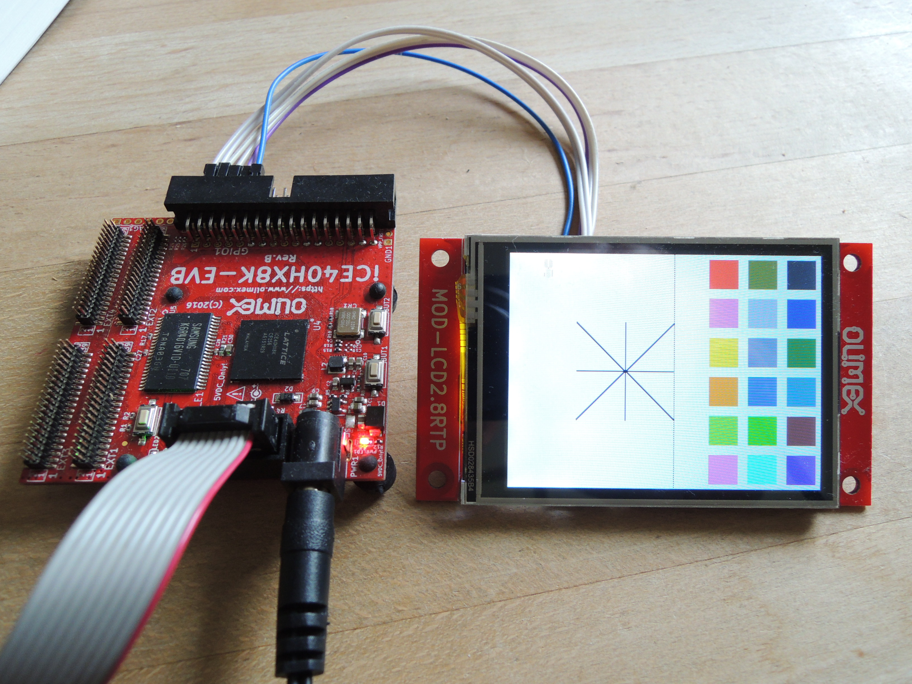

## Screen.jack
The board MOD-LCD2.8 has a driver chip ILI9341V on board, which does the low level control of the LCD-Screen. The bitmap memory is organized by ILI8341V. To write to the bitmap of ILI9341V one has to send a series of 8bit commands followed by 8/16 bit data packets whith the following specifications:

#### function void init()

After hardware reset (or power on) LCD driver has be initialised.

```
writeCommand(0x36);     //Memory Access Control
writeData(0x48);        //RGB mode

writeCommand(0x3A);     //Pixel format set
writeData(0x55);        //RGB mode 16 bit

writecommand(0x11);     //Sleep out (exit sleep mode)
delay(120 ms);

writecommand(0x29);     //Display on
delay(120 ms);
```

#### function void clearScreen()
draw a rectangle 320x240 with background color.

#### function void drawPixel(int x,int y)
set AddrWindow to one solely pixel at x,y and fill it with the pen color.

#### function void setColor(int c)
Set pen color of next drawCommand to c.

#### function void setBackColor(int c)
Set backgroundcolor of next draw command to c.

#### function void paintPixel()
Write color code of penColor to LCD.

#### function void clearPixel()
Write color code of Background color to LCD.

#### function void drawLine(int x1,int y1,int x2,int y2)
Draw a line from point (x1,y1) to (x2,y2) with selected pen color.

#### function void drawRectangle(int x, int y, int w, int h)

Draw a rectangle from point (x1,y1) to (x2,y2) with selected pen color.

#### function void drawCircle(int x, int y, int r)
Draw a circle with center (x,y) and radius r with selected pen color.

#### function void setAddrWindow(int x, int y, int w, int h)
Before you write to VideoRAM first set the range of the window to which next write instruction will address (x1,y1)-(x1-y2) with:
```
writeCommand(0x2A)    //set x-range
writeData16(x1)
writeData16(x2)

writeCommand(0x2B)    //set y-range
writeData16(y1)
writeData16(y2)
```

#### function void writeData(int data)
writes  8bit data to LCD controller.

#### function void writeData16(int data)
writes 16 bit data to LCD controller.

#### function void writeCommand(int command)
writes 8 bit command to LCD controller.

#### function int "COLOR()"

returns the RGB value according to the table:
Colors are enter as 16 bit numbers composed of Red(5bit) Green(6bit) and Blue(5bit):
```rrrrrggggggbbbbb (16 bit)```

|Color|binary|dec|
|-|-|-|
|BLACK|00000 000000 00000|0|
|NAVY|00000 000000 10000|16|
|BLUE|00000 000000 11111|31|
|GREEN|00000 111111 00000|2016|
|CYAN|00000 111111 11111|2047|
|MAROON|10000 000000 00000|~32767|
|PURPLE|10000 000000 10000|-32752|
|OLIVE|10000 100000 00000|-31744|
|DARKGREY|10000 100000 10000|-31728|
|LIGHTGREY|11000 110000 11000|-14824|
|RED|11111 000000 00000|-2048|
|MAGENTA|11111 000000 11111|-2017|
|YELLOW|11111 111111 00000|-32|
|ORANGE|11111 101001 00000|-736|
|WHITE|11111 111111 11111|-1|
**Note:** -32768 can not be entered in our compiler due to the fact, that Hack can only load CONSTANTS in the range 0..32767.

## Project
* run `Hack6.v` in real hardware with `asm/boot` preloaded to `ROM.v`
* Implement `Screen.jack` with Specifications 1.-4.
* compile `ScreenTest`
* upload to Hack
* check if LCD shows the following:


