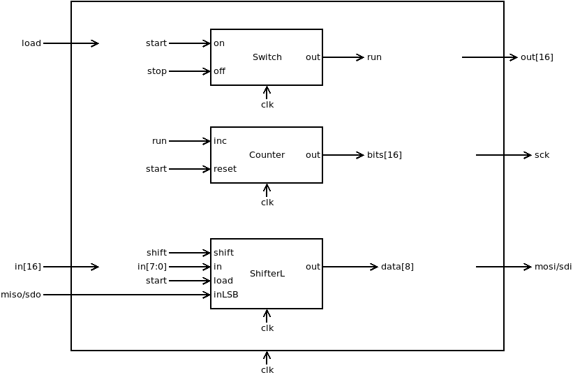
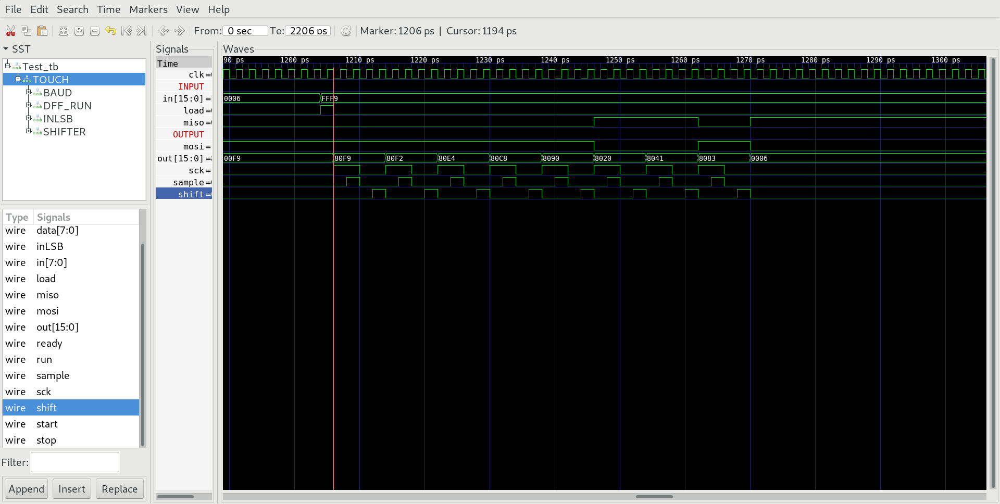

## Touch.v
Touch controls transmission to Touch-Screen controller according to timing diagramm of SPI (serial peripherial interface).

* If (load == 1) & (run == 0) Touch starts serial transmission of 8 bits in[7:0].

* During transmission out = -1 (16 bit)
* At end of transmission out = received byte (8 bit)

### Proposed implementation (draft)

* Use a Switch to store run state
* if (load==1) and (run == 0) start = 1
* bits[15:0] count the received/transmitted bits
* Use a ShifterL to store transmitted/received byte.

Attention: Due to the maximal transmission rate of the touch-module, we have to reduce the clock rate of sck by a factor of two.

## Touch_tb.v
Test bench starts transmission of a 8 bit data (load=1). Received byte should be inverse of transmitted byte (mosi is inverted to miso).

Check clock rate of sck. It should be half of clock rate clk, to ensure error free communication between Hack and touchmodule.

## Project
* Implement `Touch.v`
* Test with test bench `Touch_tb.v`
`$ apio sim`
* Compare timing diagram with `Touch_tb.png`
