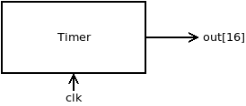
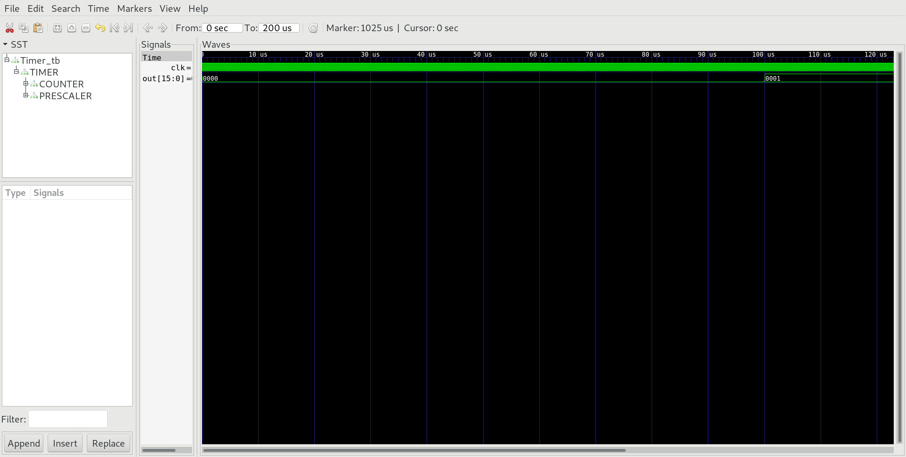

## Timer.v

out[15:0] increments by one every 0.0001 seconds when clocked at 33.333333 MHz.

## Timer_tb.v
Test bench.

## Project
* Implement the module Timer.v and all needed submodules.
**Note:** DFF and Nand are considered primitive and thus there is no need to implement them.
* Simulate your implementation with the supplied test bench `Timer_tb.v`.
* Verify by comparing with screenshot of `Timer_tb.png`.
