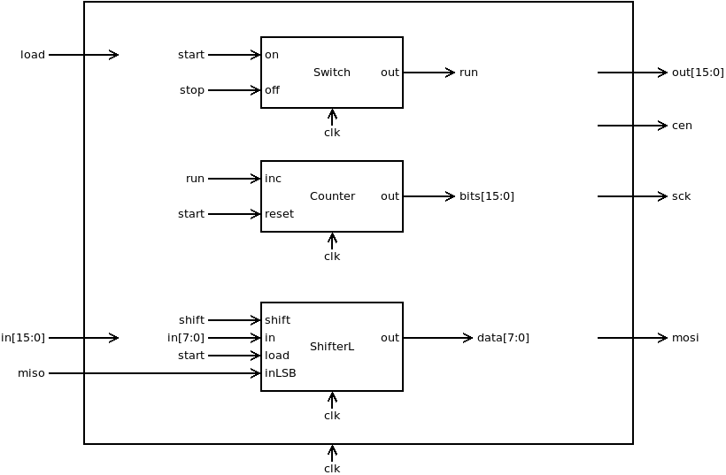
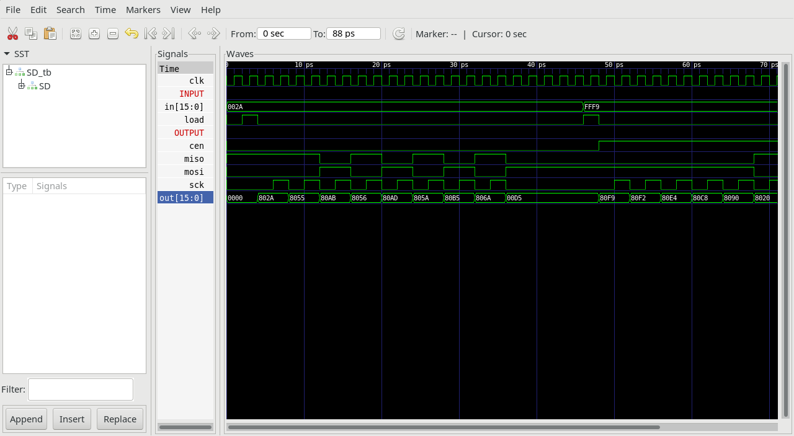

## SD.v
`SD.v` controls transmission to SD-card according to timing diagramm of SPI (serial peripherial interface).

* If (load == 1) & (run == 0) SD starts serial transmission of 8 bits in[7:0].
* If (load == 1) & (run == 0) & (in[15]==1) cen=1 during transmission (used to initialise SD card).

* During transmission out[15]=1 (sign bit)
* At end of transmission out[7:0] = received byte (8 bit)

### Proposed implementation (draft)

* Use a Switch to store run state
* if (load==1) and (run == 0) start = 1
* bits[0] is used to generate SCK
* bits[15:1] count the received/transmitted bits
* Use a ShifterL to store transmitted/received byte.

## SD_tb.v
Test bench starts transmission of two 8 bit data packets (load=1). Received byte should be inverse of transmitted byte (mosi is inverted to miso). The first byte is transmitted with cen=0, the second byte is transmitted with cen=1.

## Project
* Implement `SD.v`
* Test with test bench `SD_tb.v`
`$ apio sim`
* Compare timing diagram with `SD_tb.png`
