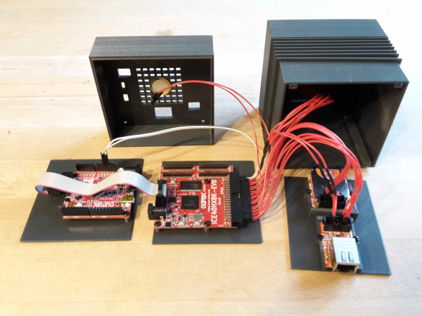
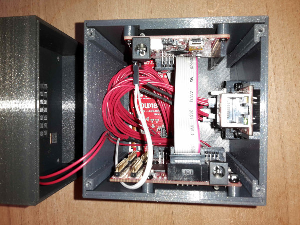
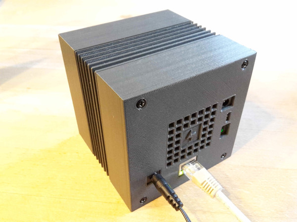
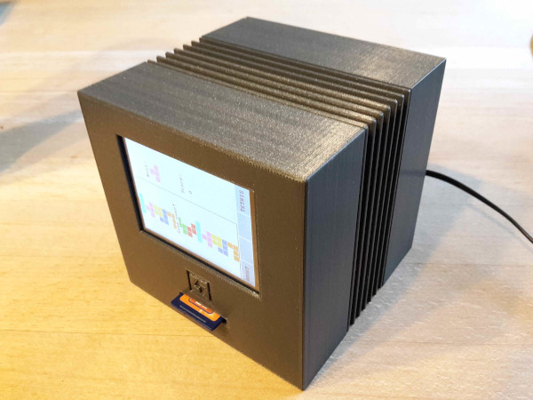

# N2Tcube

Finally we print case with a 3d-Printer. The case is a miniatur replica of the classic computer NeXTcube (https://en.wikipedia.org/wiki/NeXTcube). All components are mounted on trays, which can be pushed in the cube (10cm x 10cm x 10cm).

All the parts are modelled with free software tools.

- [blender](https://blender.org) is a very powerful 3D modelling software. All parts of the cube are modelled with blender. You can edit the blender files and change details on the design. The blender-design files can than be exported to STL-format, a common 3D-file format used for 3D-printing.
- [prusa-slic3r](https://www.prusa3d.com). This is the slicer software for 3D-Printers from the manufacturer Prusa. This programm is used to convert the STL-files to printerspecific gcode-files.

The subfolder `files/` containes the blender files, the corresponging STL-files and the already sliced gcodes for Prusa-MK3S printer.

### modules
The modules are mounted on trays with little screws (M3x5/M2.4x5 selfcutting). From left to right:
1. Olimexino 32u4: Programmer/UART bridge
2. iCE40HX8K-EVB: FPGA development board
3. SD-Card + Ethernet connector

The rear cover holds a small piezo speaker (2cm diameter).
The front side holds the screen MOD-LCD2.8RTP.

### inside
A look inide: All the modules fit nicely inside.

### rear
On the rear cover you see connectors for power supply (5V), RJ45 Ethernet connector and the USB connector which has dual usage:
1. upload bit stream files to iCE40 FPGA
2. communicate to Hack-Computer over UART

### front

On the front side you see the screen (MOD-LCD2.8RTP) and a slit to insert the SD-card.

