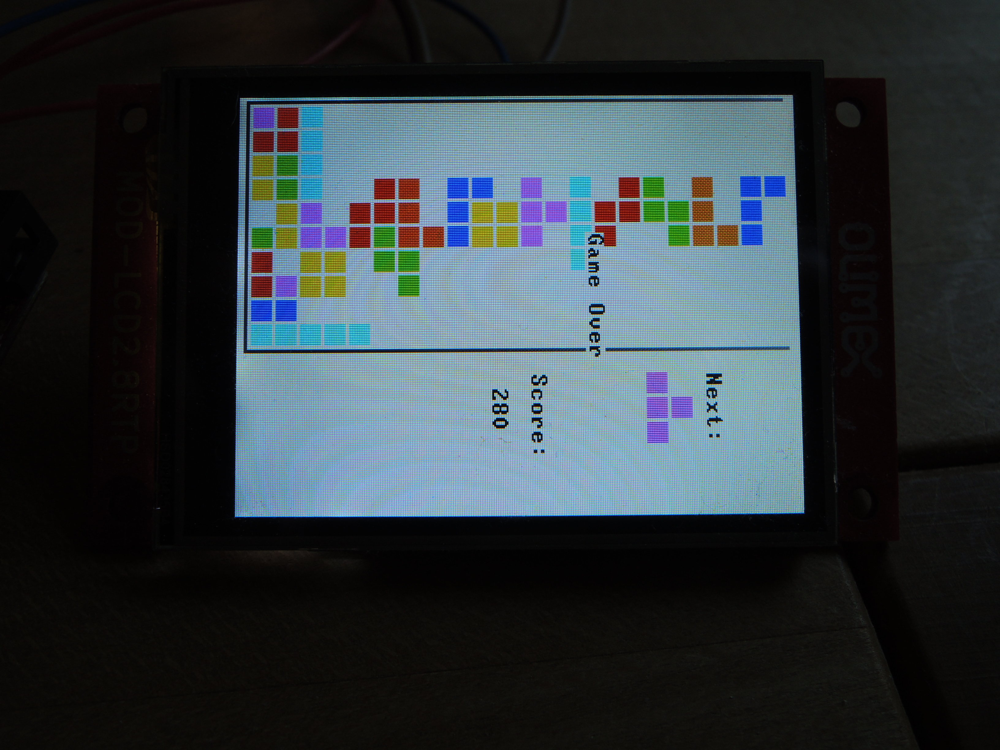
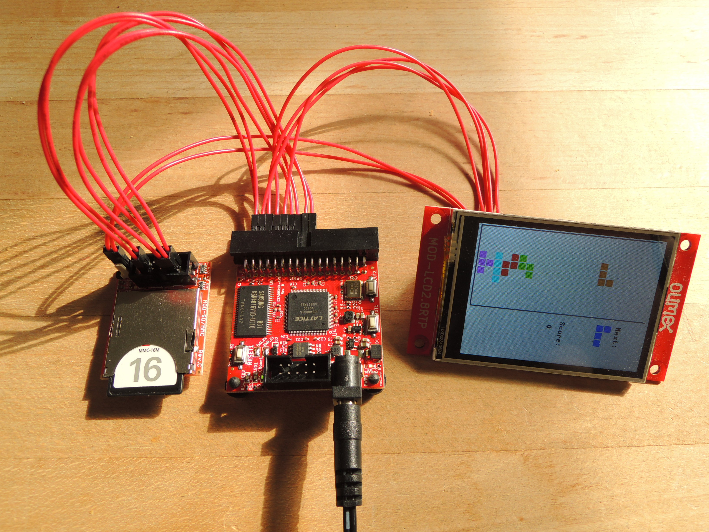

# nand2tetris-FPGA

> ... _Would'nt it be nice to make Hack or Jack also run on some "real platform," made from some "real stuff"?_ ...
>
>---Noam Nisan and Shimon Schocken

This project is about building Hack on real hardware as proposed in Chapter 13 of the course [nand2tetris](https://www.nand2tetris.org/) using only FOSS, free and open source hard- and software.

We build hack in 9 steps, starting with Hack-1, a minimal working Hack-CPU connected to some leds and buttons and ending at Hack-9, the final implementation of Hack running Jack-Compiled code with specs:
* original CPU/ALU design of HACK from nand2tetris
* implemented on iCE40 FPGA
* clocked at 33.333333 MHz
* RAM 3840 x 16 bit (R0-R15/static/stack/heap)
* Programmable instruction memory PROM 64K x 16 bit
* 2.8 Inch Color LCD with 320x240 Pixel
* SD-Card-Reader
* bootloader in ROM (256 words) boots Hack-code from SD or UART
* sound-card capable of playing the tetris theme
* touch-panel support

Finally we will proof, that Hack-9 is powerfull enough to run serious Jack-Application like Pong and Tetris!

## Roadmap

In every project folder/subfolder you find a file `Readme.md` containing specifications and implementation details.

>_... This is your last chance. After this, there is no turning back. You take the blue pill — the story ends, you wake up in your bed and believe whatever you want to believe. You take the red pill — you stay in Wonderland and I show you how deep the rabbit-hole goes. ..._
>
> ---Morpheus

### [Project0: Requirement](00_Requirement)

Get the hardware and install the tools.
### [Project 1: Hack1-minimal](01_Hack1-minimal)
Build minimal running version of Hack-CPU connected to two buttons and two leds as input/output.
### [Project 2: Hack2-UART](02_Hack2-UART)
Add UART support so Hack can send and receive bytes at runtime. First test of Virtual machine running small Jack-compiled programs like `echo`.
### [Project 3: Hack3-SRAM](03_Hack3-SRAM)
Hack writes and reads data to external SRAM-chip so bigger Hack-programms can be stored (64K x 16 bit).
### [Project 4: Hack4-BOOT](04_Hack4-BOOT)
Bootlogic can switch instruction memory between internal ROM (boot-mode) and external SRAM (run-mode).
### [Project 5: Jack-OS](05_Jack-OS)
Hack now has 3840 x 16 bit of RAM for stack/heap, 256 x 16 bit of ROM preloaded with bootloader and 64K x 16 bit of programmable instruction memory. It's time to implement Jack-OS and run application like `Average`.
### [Project 6: Hack6-LCD](06_Hack6-LCD)
Connect Screen MOD-2.8LCD-RTP with 320x240 pixels in 16 bit color depth. Rewrite parts of OS `Screen.jack` and `Output.jack`. Play Pong!

### [Project 7: Hack7-TOUCH](07_Hack7-Touch)
Add support for resistive touch panel of MOD-2.8LCD-RTP. Just because it's there.
### [Project 8: Hack8-SOUND](08_Hack8-Sound)
Build "mini sound-card" capable of playing Tetris-theme.

### [Project 9: Hack9-SDCard](09_Hack9-SD)
Add SD-card reader MOD-SDMMC. Reimplement bootloader capable of loading Jack-compiled code from SD-Card directly into SRAM. Play Tetris!

## Credits

* Noam Nisan and Shimon Schocken: Visit [nand2tetris](https://nand2tetris.org) and learn to build a modern general-purpose computer system from ground up.
* [Olimex Ltd](https://www.olimex.com/): Buy your hardware from the Company with highest number of registered OSHW projects :)
* Wolf Clifford: The master of open source FPGA with iCE40 and  [Project IceStorm](http://www.clifford.at/icestorm/)
* Jesús Arroyo Torrens, Juan González (Obijuan): Open source ecosystem for open FPGA boards [APIO](https://github.com/FPGAwars/apio)
* Juan González-Gomez (Obijuan): Lern verilog with [open-fpga-verilog-tutorial](https://github.com/Obijuan/open-fpga-verilog-tutorial/), best tutorial!
* Icons made by <a href="https://www.flaticon.com/free-icon/cpu_483131?term=cpu&page=3&position=86" title="Those Icons">Those Icons</a> from <a href="https://www.flaticon.com/" title="Flaticon"> www.flaticon.com</a>

---
For questions or comments write an email to
mi.schroeder@netcologne.de
